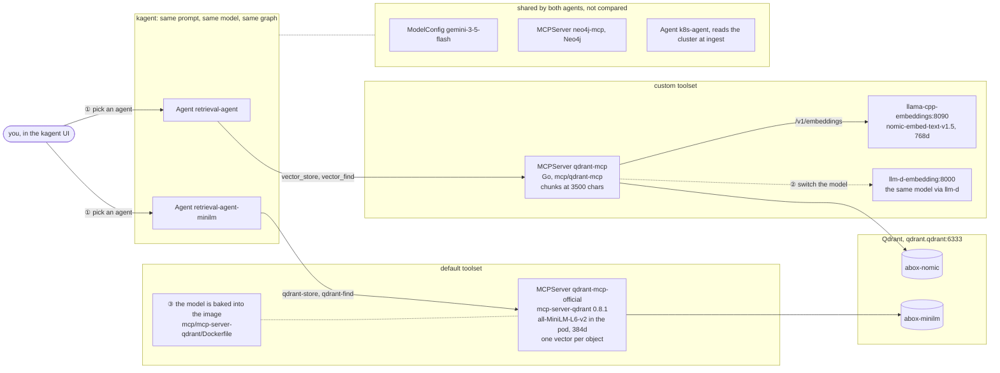

# Retrieval toolsets: setup and switching

abox runs two retrieval agents that differ in one thing only, the vector toolset:

- **Custom:** `retrieval-agent` on our Go `qdrant-mcp`.
- **Default:** `retrieval-agent-minilm` on the official `mcp-server-qdrant`.

This guide walks the comparison by hand: see the setup, switch the toolset and the
model, get a result, and compare. For the measured comparison and the decision it
supports, see [ADR 0001](adr/0001-retrieval-agent-vector-toolset.md).

## The setup



|  | custom | default |
|---|---|---|
| agent | `retrieval-agent` | `retrieval-agent-minilm` |
| MCP server | `qdrant-mcp`, ours | `qdrant-mcp-official`, `mcp-server-qdrant` 0.8.1 |
| tools | `vector_store`, `vector_find` | `qdrant-store`, `qdrant-find` |
| where the model runs | behind `/v1/embeddings`, in the cluster's llama.cpp | inside the MCP server's pod (fastembed) |
| model | nomic-embed-text-v1.5, 768 dims | all-MiniLM-L6-v2, 384 dims |
| what gets embedded | every chunk of 3500 chars, so the whole object | the first **128 tokens** of each object |
| collection | `abox-nomic` | `abox-minilm` |
| a find returns | the matching chunk, with a score | the whole stored object, no score |

The circled numbers are the switch points:

- **①** The toolset: which agent you talk to.
- **②** The custom server's model: an env change.
- **③** The default server's model: an image rebuild plus an env change.

## Before you start

1. **Put a Gemini key in `.env`** (`GOOGLE_API_KEY=…`) and run `make run`.
   `scripts/setup.sh` turns it into the `kagent-gemini` Secret that the ModelConfig
   reads.
2. **Use an x86 host.** The nomic image is amd64-only, which is fine on Codespaces.
   To run on an arm64 Mac, build an arm64 image from `images/nomic-embed/Dockerfile`
   (see the README).
3. **Pause Flux while you practise.** Flux puts every object back to the published
   release on its next reconcile, which would undo a live patch, including the next
   step's. Pause it:

   ```bash
   kubectl -n flux-system patch kustomization releases --type merge -p '{"spec":{"suspend":true}}'
   ```

   Resume it when you are done ([Clean up](#clean-up)). Publishing a change for good
   means editing `releases/` and running `make push`. A cluster only picks up
   releases from the registry it was bootstrapped with: `var.oci_registry`, which
   is upstream's by default.
4. **Give the default server a real image.** `releases/mcp-servers.yaml` still has
   the `0.8.1-<sha>` placeholder, so that pod cannot start. CI builds the image into
   the GHCR namespace of whichever repo it runs in:

   ```bash
   gh run list --workflow mcp-server-qdrant-image.yaml    # the tag is 0.8.1-<first 7 chars of headSha>
   ```

   At the time of writing, `ghcr.io/ingvar-goryainov/abox/mcp-server-qdrant:0.8.1-4de8aa2`
   exists and is public. A newly pushed package is private until you make it public,
   and the kind nodes have no pull secret. Point the MCPServer at it:

   ```bash
   kubectl -n kagent patch mcpserver qdrant-mcp-official --type merge -p '{"spec":{"deployment":{
     "image":"ghcr.io/ingvar-goryainov/abox/mcp-server-qdrant:0.8.1-4de8aa2"}}}'
   kubectl -n kagent get pods -w      # wait for the qdrant-mcp-official pod to be Running
   ```

## 1. See it

```bash
kubectl -n kagent get agents,mcpservers,modelconfigs
kubectl -n kagent get pods                                   # one pod per agent and per MCPServer
kubectl -n kagent get mcpserver qdrant-mcp -o yaml           # where the custom server embeds, and into which collection
kubectl -n kagent get mcpserver qdrant-mcp-official -o yaml  # the default server's model and collection

kubectl -n qdrant port-forward svc/qdrant 6333:6333 &        # Qdrant's UI: http://localhost:6333/dashboard

# the kagent UI, where both agents are listed: through the gateway...
GW=$(kubectl get svc -n agentgateway-system -o jsonpath='{.items[?(@.spec.type=="LoadBalancer")].status.loadBalancer.ingress[0].ip}')
echo "http://$GW/"
# ...or, where the gateway IP is not reachable from your browser (Codespaces):
kubectl -n kagent port-forward svc/kagent-ui 8080:8080 &     # http://localhost:8080/
```

## 2. Switch the toolset ①

Talk to one agent, then to the other. There are two agents rather than one agent
with a swappable tool because the prompt names its tools:
`retrieval-agent`'s says `vector_find`, and the other's says `qdrant-find`. The two
prompts are identical apart from those names, so the toolset is the only variable.

To rewire a single agent instead, change all three of these together in
`releases/agent-retrieval.yaml`: `tools[].mcpServer.name`, `toolNames`, and the
tool names in `systemMessage`.

## 3. Get a result

**Ingest the same objects through both agents.** Send each agent the same message,
for example:

> Ingest these objects from namespace kagent: Agent retrieval-agent, Agent
> retrieval-agent-minilm, Agent k8s-agent, ModelConfig gemini-3-5-flash, MCPServer
> qdrant-mcp, MCPServer qdrant-mcp-official, MCPServer neo4j-mcp.

The agent asks `k8s-agent` for each object's live YAML and stores it in its own
collection. Then check what landed:

```bash
curl -s localhost:6333/collections/abox-minilm | jq .result.points_count   # one point per object
curl -s localhost:6333/collections/abox-nomic  | jq .result.points_count   # more: long objects become several chunks
```

In the dashboard, open a point from each collection. The default server's payload
holds the whole object under `document`. Ours holds one chunk, with `chunk`/`chunks`
and the object's `kind`, `name` and `namespace`.

**Ask both agents the same questions.** Where the answer sits in the object is what
separates the two toolsets:

| question | where the answer sits | what to expect |
|---|---|---|
| Which provider and model does ModelConfig gemini-3-5-flash use, and which Secret holds its key? | near the top of a short object | both answer |
| Which tools can Agent retrieval-agent-minilm call? | `spec.declarative.tools`, after a system prompt of about 2,000 tokens | the default server never embedded it |
| What memory limit does MCPServer qdrant-mcp-official set? | `resources`, after the env block | the default server never embedded it |
| Which Redis deployment does kagent use? | nowhere | both should say nothing relevant is stored |

**Grow the collection.** With seven objects both agents will look equally good.
Five hits return most of the collection, and the default server hands back whole
objects, so the answer reaches the agent even from a part that was never embedded.
To see the difference, ingest more (for example every HelmRelease and every
Deployment in the cluster) and ask again. That is Finding 2 of the ADR: the default
server kept up at 51 objects and fell behind at 187.

Live objects carry no comments. A "why" question answered by a comment in
`releases/` has no answer in the cluster.

## 4. Switch the model

A new model, or the same model on a different runtime, is a new vector space. Give
it a new collection and ingest again. Nothing errors if you reuse a collection:
the ranking just quietly gets worse.

### ② The custom server: an env change

Point it at llm-d's route to the same model:

```bash
kubectl -n kagent patch mcpserver qdrant-mcp --type merge -p '{"spec":{"deployment":{"env":{
  "EMBEDDINGS_BASE_URL":"http://llm-d-embedding.llm-d:8000",
  "QDRANT_COLLECTION":"abox-nomic-llmd"}}}}'
```

A different model on a managed endpoint also needs `EMBEDDINGS_MODEL` and
`EMBEDDINGS_API_KEY`. Set both prefixes to empty unless the model is a nomic one;
see `mcp/qdrant-mcp/README.md`, "Routing to a different backend". Keep
`EMBEDDING_MAX_INPUT_CHARS` inside the new model's token window, at roughly 3.8
characters per token for YAML.

### ③ The default server: rebuild the image

The server only loads models that fastembed supports, and it loads them from the
image. The weights are baked in at build time, and the pod cannot download at run
time. So:

1. In `mcp/mcp-server-qdrant/Dockerfile`, change the model the `RUN python -c
   "…TextEmbedding('…')"` line fetches. `BAAI/bge-small-en-v1.5` is a good first
   switch: 384 dims, 67 MB, and a 512-token window, four times MiniLM's.
2. Push. CI builds `0.8.1-<sha>`; make the package public.
3. Point the MCPServer at the new image, model and collection:

   ```bash
   kubectl -n kagent patch mcpserver qdrant-mcp-official --type merge -p '{"spec":{"deployment":{
     "image":"ghcr.io/<owner>/abox/mcp-server-qdrant:0.8.1-<sha>",
     "env":{"EMBEDDING_MODEL":"BAAI/bge-small-en-v1.5","COLLECTION_NAME":"abox-bge"}}}}'
   ```

The new collection name matters more here than anywhere else. bge has the same 384
dimensions as MiniLM, so Qdrant would accept its vectors into `abox-minilm` without
complaint. Different dimensions were the only thing keeping the two spaces apart.

Mind the pod's 1Gi memory limit: the f32 nomic ONNX OOMKilled this server at 2Gi.

If an agent still answers from the old server after a patch, restart it:
`kubectl -n kagent rollout restart deploy/<agent name>`.

## 5. Compare

For each question and agent, note:

- **Correct?** Does the answer contain what the object actually says?
- **Cited source.** Which object, by kind, name and namespace. Is it the one that
  holds the answer?
- **Searches.** The prompt allows three. The kagent UI shows each tool call.
- **Depth.** Was the answer near the top of the object, or deep inside it?

Reference results from the scripted run, gemini-3.5-flash, 30 questions per corpus:

|  | default | custom |
|---|---|---|
| share of each manifest actually embedded | 25% | 100% |
| correct answers, 51 objects | 30/30 | 30/30 |
| correct answers, 187 objects | 24/30 | 27/30 |
| answer text reached the agent, 187 objects | 80% | 100% |
| heaviest question, input tokens | 501k | 40k |

## Clean up

```bash
kubectl -n flux-system patch kustomization releases --type merge -p '{"spec":{"suspend":false}}'
curl -X DELETE localhost:6333/collections/abox-nomic-llmd    # and any other collection you created
```

Resuming Flux puts the MCPServers back to the published release. Collections you
created stay in Qdrant until you delete them.

## The same comparison, scripted

[`evals/retrieval`](../evals/retrieval/README.md) runs this comparison without a
cluster, over 32 fixed questions. There, switching is an argument rather than a
patch:

```bash
python harness.py find base official-minilm   # default toolset
python harness.py find base go-nomic          # custom toolset
python harness.py find base go-minilm         # custom toolset on the default model
```

To add a model or a server, add an entry to `arms()` in `evals/retrieval/common.py`.
A new fastembed model also needs adding to the list `embed_shim.py` serves.
