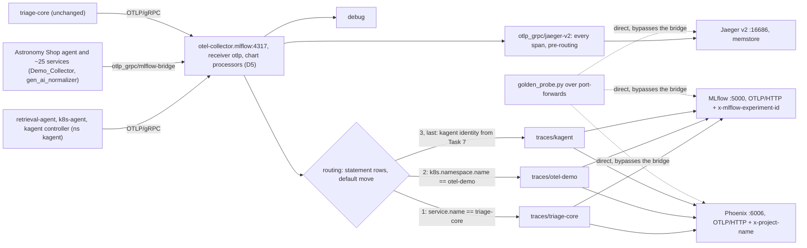
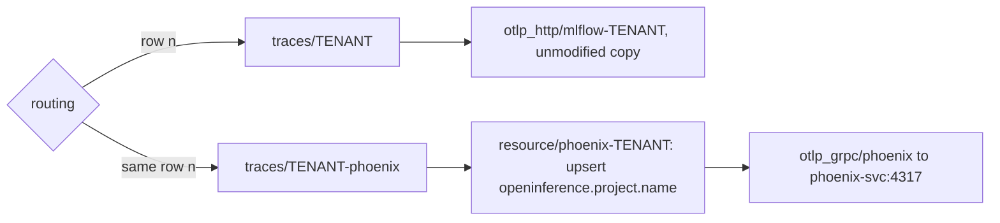

# Design Document: genai-observability-comparison

## Overview

This design implements the approved plan v2 on branch `feat/otel-demo`. This spec, canonical under `docs/specs/genai-observability-comparison/`, is the source of truth (10.12). The Bridge_Collector fans one span stream out to Jaeger v2, MLflow and Phoenix; the Fixed_Workload drives it; `OBSERVABILITY.md` compares the three Backends from a GenAI perspective.

- Criteria are cited as m.n. Values that still need confirmation on the Cluster, including values observed before execution, appear only as decision rows (see Decision table).
- Phases: 0 baseline docs reconciliation, offline, Root_Docs only (see Phase 0); A offline prep (Tasks 0a, 1–7, the Task 11 draft, the two Decision_Log records), ending at the Phase_A_Review_Gate; B access, the read-only Task 0b, the Phase B checkpoint message, the Kagent_Exposure_Gate decision, the consented suspend and any chosen restriction; C on the Cluster (Tasks 1–8 and 10, Task 9 only if accepted); D (Tasks 11 and 12).
- Languages: YAML for the Exercise_Config, Python 3.13 for the Golden_Probe and offline tooling, bash for Scratch_Dir scripts.

| Group | Covers | Sections |
|---|---|---|
| R1 Interfaces (DoD 1) | Interface_Matrix, collector as built, Golden_Probe | Architecture, Golden_Probe, `OBSERVABILITY.md` outline, Testing Strategy |
| R2 Traces (DoD 2) | Tasks 1 and 3–10, Tenants, Parity, Fixed_Workload, Load_Run | Architecture, Exercise_Config, Tenancy and routing, Decision table, Decision_Log, Phase C apply mechanics, Workload and evidence, Testing Strategy |
| R3 Comparison (DoD 3) | Observability_Doc with its Outstanding risks section (3.28), Task 12's README.md and CODEBASE.md edits (3.1–3.3) | `OBSERVABILITY.md` outline |
| R4 Access and kubeconfig isolation | Phase B, Task 0b, the Phase B checkpoint message (4.15) | Decision table, Phase B checkpoint message, Phase C apply mechanics, Execution-environment constraints |
| R5 Git and release hygiene | commits, pushes, Release, the clean tree at Phase 0 and Phase A start (5.4), Reviewer_Exit_Criteria (5.18–5.20) | Phase C apply mechanics, Release and ownership, Spec_Copies and Spec_Sync |
| R6 Consent and blast radius | diff, suspend, Exercise_Apply, the Phase_A_Review_Gate (6.12, 6.13), the checkpoint's review items with the rollback and cleanup plan (6.11) | Decision table, Phase_A_Review_Gate, Phase B checkpoint message, Rollback and cleanup plan, Phase C apply mechanics, Release and ownership |
| R7 Exposure and secrets | Kagent_Exposure_Gate (decided in Phase B, before the suspend), Port_Map, Secrets by name | Workload and evidence, Kagent_Exposure_Gate, Phase B checkpoint message, Error Handling |
| R8 Evidence and cleanup | Scratch_Dir versus Evidence_Dir, cleanup | Workload and evidence, Rollback and cleanup plan, Testing Strategy |
| R9 Pinning and repeated failures | versions, checksums | Execution-environment constraints, Testing Strategy |
| R10 Spec copies and sync | Spec_Copies, Spec_Sync, Spec_Readme, source of truth and the uncommitted scratch plan (10.12–10.15) | Overview, Spec_Copies and Spec_Sync |
| R11 Baseline docs reconciliation (Phase 0) | Root_Docs versus Baseline_Manifests, Known_Deviations, the Task 12 re-check (11.9), the Workstation's kind (11.8) | Phase 0, Execution-environment constraints, Release and ownership, Error Handling, Testing Strategy |

## Architecture

One receiver, three sinks. Jaeger sits on the top-level `traces` pipeline, before routing.



Decisions:

1. Jaeger on the top-level pipeline holds the reference copy of every span and is the safety net for a routing table with no catch-all (2.9, 2.11, 2.70).
2. Phoenix takes OTLP/HTTP on 6006 with `x-project-name`, mirroring MLflow's experiment header. This needs Phoenix app 15.5.0 or later (D1); otherwise the fallback (see Phoenix fallback) applies (2.20).
3. Tenants follow trace boundaries. otel-demo is one Tenant, because Astronomy agent traces cross into other otel-demo services. Every kagent-side service shares the kagent Tenant (2.55, 2.69).
4. triage-core gets Jaeger and Phoenix for free as the Control_Source, and MLflow experiment `2` keeps receiving (2.17).
5. retrieval-agent and the chart's `k8s-agent` use the mirrored Gemini ModelConfig (2.35–2.38).
6. The Golden_Probe sends straight to each Backend, so routing never sees its spans (1.8).

### Phoenix fallback

Used when the Phoenix app is below 15.5.0, or when Phoenix ignores the header on the Cluster (2.20, 2.23, 2.26):



Each row lists both pipelines. The `resource` processor mutates data, so the collector clones the batch for each consumer and the MLflow copy stays unmodified.

### Components

| Component | Object | Ingest used here | Tenant mechanism |
|---|---|---|---|
| Bridge_Collector | HelmRelease `otel-collector`, ns `mlflow` | `otlp` on 4317 (gRPC) and 4318 (HTTP) | routing connector rows |
| Jaeger | HelmRelease `jaeger`, ns `jaeger`, Service `jaeger` | OTLP 4317/4318; UI and read APIs on 16686 | none; groups by `service.name` |
| MLflow | Service `mlflow-mlflow:5000` | OTLP/HTTP `/v1/traces` | header `x-mlflow-experiment-id` |
| Phoenix | Service `phoenix-svc` (D4) | OTLP/HTTP `/v1/traces` on 6006; gRPC on 4317 | header `x-project-name`, or resource attribute `openinference.project.name` |
| Demo_Collector | chart `opentelemetry-demo` 0.41.2, ns `otel-demo` | sends through `otlp_grpc/mlflow-bridge` | n/a; its dead `otlp_grpc/jaeger` keeps the original endpoint (2.12) |
| kagent | controller and agent pods, ns `kagent` | `OTEL_*` env propagated by the controller (Task 7) | kagent row (see Tenancy and routing) |

## Components and Interfaces

### Phase 0

Baseline docs reconciliation (R11): offline, on the Workstation, Root_Docs only. It runs after the add commit of 10.2 has landed and before Phase A and any Exercise_Config change (11.1), from the clean tree of 5.4. Nothing is pushed or applied.

Method (11.2, 11.4): compare every version, path, tool and release-behavior statement in each Root_Doc (`README.md`, `CODEBASE.md`, `REVIEW.md`, `EVALS.md`) with the Baseline_Manifests at the 10.2 commit, and list each mismatch with file and line in `/tmp/abox-observability/phase0-mismatches.txt`. The Root_Docs change; the Baseline_Manifests never do.

Known drift (11.3). The rows come from a grep made before execution; the 11.2 list is authoritative and may add rows.

| Item | Root_Doc to fix | Source of truth |
|---|---|---|
| kagent: CODEBASE.md says kagent is pinned to `0.7.23`; REVIEW.md and EVALS.md treat `0.7.23` as the pin | `CODEBASE.md`, `REVIEW.md`, `EVALS.md` | chart 0.10.1 in `releases/kagent.yaml` and `releases/crds/kagent-crds.yaml`; `releases/kagent.yaml` handles the `+` build metadata with a postRenderer and explicit image tags |
| Phoenix chart: 12.0.10 | `README.md`, `CODEBASE.md` | chart `phoenix-helm` 12.0.14, `releases/phoenix.yaml` |
| agentgateway: v2.2.1 | `README.md` (`CODEBASE.md` already says 1.5.0) | chart 1.5.0, `releases/agentgateway.yaml` |
| MLflow: no row in the component table | `README.md` | `releases/mlflow.yaml` (chart `oci://ghcr.io/mlflow/charts/mlflow` 0.1.0) |
| RSIP path: `oci://ghcr.io/den-vasyliev/abox/releases` | `README.md` | `releases-otel-demo` under the configured registry on this branch, `bootstrap/variables.tf` and `bootstrap/flux.tf` |
| Release guidance: lexicographic tag sort and a patch ceiling of 9 | `README.md` (RSIP note), `CODEBASE.md` (Forbidden Patterns), `REVIEW.md` (flags and "Lexicographic tag sorting"), `EVALS.md` | semver sorting in `bootstrap/flux.tf` (highest tag matching `^\d+\.\d+\.\d+$`); `make push` bumps the patch with no ceiling (`Makefile`, unchanged per 5.16) |
| kind: every kind or node-image version a Root_Doc states | each Root_Doc that states one; the grep found only CODEBASE.md's node image `v1.37.0`, which matches | kind v0.33.0, `scripts/setup.sh`; `kindest/node:v1.37.0`, `bootstrap/variables.tf` (11.8) |
| gateway-api-crds: "Managed via HelmRelease (`ghcr.io/den-vasyliev/gateway-api-crds:1.4.0`)" | `CODEBASE.md` | `releases/crds/gateway-api-crds.yaml`: GitRepository `kubernetes-sigs/gateway-api` at `v1.6.2` plus Kustomization `gateway-api-crds` |
| `releases/crds/` contents in the bootstrap diagram: gateway-api-crds, agentgateway-crds, kagent-crds | `README.md` | `releases/crds/kustomization.yaml`, which also lists `inference-extension-crds.yaml` and `ngrok-operator.yaml` |
| Any other mismatch on the 11.2 list | the file and line it names | the Baseline_Manifest it names |

Known_Deviations (11.5): a Baseline_Manifest fact that breaks a Root_Doc rule stays as is and gets a note next to the rule, naming the file and field. Known case: `ref.tag: latest` in `releases/graph-otel-demo.yaml` and `releases/pages-triage.yaml`, against the never-`latest` rule in CODEBASE.md (Versioning, Forbidden Patterns), REVIEW.md and EVALS.md.

Validation, before the commit:

- Re-grep every corrected fact: the new value appears in its source-of-truth file, and the old value is gone from the Root_Docs except inside a Known_Deviation note.
- `git diff --name-only HEAD` lists only Root_Docs, and `git diff --quiet HEAD -- releases bootstrap scripts/setup.sh Makefile` exits 0 (11.4).
- The Secret_Scan and the 10.10 searches pass over the changed Root_Docs (11.6).

Commit (11.6): branch check (5.1), stage the changed Root_Docs by name, and commit only them as `docs: <summary>`, for example `docs: reconcile root docs with baseline manifests`, with the 11.2 mismatch list in the body. Then repeat the 11.2 comparison and confirm that only recorded Known_Deviations remain (11.7).

Task 12 re-check (11.9): after Task 12's README.md and CODEBASE.md edits, repeat the comparison against the final Baseline_Manifests, Exercise_Config included (for example Jaeger chart 4.14.0 and the observed Phoenix app version), and fix any new mismatch in a `docs: …` commit, so only recorded Known_Deviations remain.

### Exercise_Config

Exact changes per file and Task. Validation is in Offline checks, under Testing Strategy.

#### Task 1: `releases/jaeger.yaml` (2.1–2.7)

```yaml
# Jaeger v2: the Standard_OTel reference Backend for the GenAI observability comparison.
# - Fed only by the Bridge_Collector (mlflow/otel-collector), from its top-level traces pipeline.
# - Storage is memory-only and bounded by max_traces; a pod restart loses every trace.
# - userconfig is a COMPLETE override of the binary's embedded all-in-one config, so it
#   defines healthcheckv2 itself: the chart's probes hit :13133/status.
# - uiconfig is a map: the chart runs toJson on it, so a string would be double-encoded.
# - Access is kubectl port-forward only. No HTTPRoute: Jaeger has no auth, and its store
#   will hold prompts, tool output and manifests.
# - No dependsOn: the chart ships no CRDs.
apiVersion: v1
kind: Namespace
metadata:
  name: jaeger
---
apiVersion: source.toolkit.fluxcd.io/v1
kind: HelmRepository
metadata:
  name: jaegertracing
  namespace: flux-system
spec:
  interval: 1h
  url: https://jaegertracing.github.io/helm-charts
---
apiVersion: helm.toolkit.fluxcd.io/v2
kind: HelmRelease
metadata:
  name: jaeger
  namespace: jaeger
spec:
  interval: 10m
  chart:
    spec:
      chart: jaeger
      version: 4.14.0
      sourceRef:
        kind: HelmRepository
        name: jaegertracing
        namespace: flux-system
  values: {} # replaced by the spec.values block below
```

The `interval` values, and any install or upgrade blocks, copy the pattern of `releases/opentelemetry-demo.yaml` (2.1); the numbers above are placeholders for that copy.

`spec.values`, exactly as below (2.2, 2.3):

```yaml
jaeger:
  resources:
    requests: {cpu: 100m, memory: 256Mi}
    limits: {cpu: "1", memory: 1Gi}
uiconfig:
  useOpenTelemetryTerms: true      # same setting the OTel demo uses (demo PR #3694)
userconfig:
  service:
    extensions: [jaeger_storage, jaeger_query, healthcheckv2]
    pipelines:
      traces:
        receivers: [otlp]
        processors: [batch]
        exporters: [jaeger_storage_exporter]
    telemetry:
      resource: {service.name: jaeger}
      metrics:
        level: detailed
        readers:
          - pull: {exporter: {prometheus: {host: 0.0.0.0, port: 8888}}}
  extensions:
    healthcheckv2:
      use_v2: true
      http: {endpoint: 0.0.0.0:13133}
    jaeger_query:
      storage: {traces: memstore}
      ui: {config_file: /etc/jaeger/ui-config.json}
    jaeger_storage:
      backends:
        memstore:
          memory: {max_traces: 5000}
  receivers:
    otlp:
      protocols:
        grpc: {endpoint: 0.0.0.0:4317}
        http: {endpoint: 0.0.0.0:4318}
  processors:
    batch: {}
  exporters:
    jaeger_storage_exporter: {trace_storage: memstore}
```

- Ingress and HTTPRoute off (2.2): the chart's own enable flags are set to `false`, with key names read from `/tmp/abox-observability/jaeger-4.14.0-values.yaml`. The render must contain no Ingress and no HTTPRoute.
- `jaeger.resources` keeps the pod out of `BestEffort` (2.8). `max_traces: 5000` bounds the memory store (2.3); eviction handling is in Workload and evidence.

#### Tasks 3, 4 and 8: `releases/mlflow-otel-collector.yaml` (2.9–2.21, 2.53–2.59)

Target `spec.values.config` after Task 8, header mechanism. Receivers stay as they are (`jaeger` and `zipkin` nulled, their ports disabled). Comments name the Task that adds each element.

```yaml
config:
  exporters:
    otlp_grpc/jaeger-v2:                  # Task 3
      endpoint: jaeger.jaeger.svc.cluster.local:4317
      tls: {insecure: true}
    otlp_http/mlflow-triage-core:         # unchanged
      endpoint: http://mlflow-mlflow.mlflow.svc.cluster.local:5000
      tls: {insecure: true}
      headers: {x-mlflow-experiment-id: "2"}
    otlp_http/mlflow-otel-demo:           # unchanged
      endpoint: http://mlflow-mlflow.mlflow.svc.cluster.local:5000
      tls: {insecure: true}
      headers: {x-mlflow-experiment-id: "3"}
    otlp_http/mlflow-kagent:              # Task 8: the ID returned at creation (2.52, 2.53)
      endpoint: http://mlflow-mlflow.mlflow.svc.cluster.local:5000
      tls: {insecure: true}
      headers: {x-mlflow-experiment-id: "<kagent experiment ID>"}
    otlp_http/phoenix-triage-core:        # Task 4
      endpoint: http://phoenix-svc.phoenix.svc.cluster.local:6006
      tls: {insecure: true}
      headers: {x-project-name: triage-core}
    otlp_http/phoenix-otel-demo:          # Task 4
      endpoint: http://phoenix-svc.phoenix.svc.cluster.local:6006
      tls: {insecure: true}
      headers: {x-project-name: otel-demo}
    otlp_http/phoenix-kagent:             # Task 8
      endpoint: http://phoenix-svc.phoenix.svc.cluster.local:6006
      tls: {insecure: true}
      headers: {x-project-name: kagent}
  connectors:
    routing:
      table:                              # statement style, specific to broad (2.58)
        - statement: route() where resource.attributes["service.name"] == "triage-core"
          pipelines: [traces/triage-core]
        - statement: route() where resource.attributes["k8s.namespace.name"] == "otel-demo"
          pipelines: [traces/otel-demo]
        - statement: route() where KAGENT_CONDITION   # Task 8, last row (see Tenancy and routing)
          pipelines: [traces/kagent]
```

Continued, same `config`:

```yaml
config:
  service:
    pipelines:
      traces:                             # Task 3: Jaeger next to debug and routing
        receivers: [otlp]
        exporters: [debug, otlp_grpc/jaeger-v2, routing]
      traces/triage-core:
        receivers: [routing]
        exporters: [otlp_http/mlflow-triage-core, otlp_http/phoenix-triage-core]
      traces/otel-demo:
        receivers: [routing]
        exporters: [otlp_http/mlflow-otel-demo, otlp_http/phoenix-otel-demo]
      traces/kagent:                      # Task 8
        receivers: [routing]
        exporters: [otlp_http/mlflow-kagent, otlp_http/phoenix-kagent]
```

- `traces` sets no `processors` key, so the chart defaults survive the Helm map merge; the render records them (2.14, D5).
- `compression: none` goes on every `otlp_http/mlflow-*` exporter if MLflow is below 3.7 (4.14, D3), and on every Phoenix exporter if Phoenix rejects gzip (2.27, D11).
- Task 3 and Task 4 are separate Phase A commits. Task 8 is a Phase C commit (2.60).

Fallback delta (2.20), replacing the three `otlp_http/phoenix-*` exporters:

```yaml
config:
  processors:
    resource/phoenix-triage-core:
      attributes: [{key: openinference.project.name, value: triage-core, action: upsert}]
    resource/phoenix-otel-demo:
      attributes: [{key: openinference.project.name, value: otel-demo, action: upsert}]
    resource/phoenix-kagent:              # Task 8
      attributes: [{key: openinference.project.name, value: kagent, action: upsert}]
  exporters:
    otlp_grpc/phoenix:
      endpoint: phoenix-svc.phoenix.svc.cluster.local:4317
      tls: {insecure: true}
  service:
    pipelines:
      traces/triage-core-phoenix:         # same shape for otel-demo and kagent
        receivers: [routing]
        processors: [resource/phoenix-triage-core]
        exporters: [otlp_grpc/phoenix]
```

Each routing row then lists `[traces/<tenant>, traces/<tenant>-phoenix]`, and `traces/<tenant>` keeps only its MLflow exporter.

Header comment rewrite (2.11, 2.21, 2.54), replacing "only these two sources exist today":

1. Fan-out shape: one `otlp` receiver; top-level `traces` to `debug`, `otlp_grpc/jaeger-v2` and `routing`; each Tenant pipeline to its MLflow and Phoenix exporters.
2. Why Jaeger sits before routing: it holds the reference copy of every span and is the safety net for a table with no catch-all.
3. Routing rules: `statement` style, specific to broad, default `move`; the kagent row is last and exact (see Tenancy and routing).
4. The Phoenix mechanism in use, why the header needs OTLP/HTTP (`x-project-name` applies only to OTLP/HTTP), the 15.5.0 requirement and the observed app version.
5. Experiment IDs `2` (triage-core), `3` (otel-demo) and the kagent ID. After a PVC wipe, recreate them in that order with `POST /api/2.0/mlflow/experiments/create`; IDs are assigned on creation, so a changed ID means a header update in a new commit.
6. The Demo_Collector's `otlp_grpc/jaeger` stays on its original endpoint, so Jaeger receives each otel-demo span once (2.12). The `golden-probe` experiment never appears here (1.21).

#### Task 6: Gemini model (2.35–2.39)

`releases/model-configs.yaml` is a byte-identical copy of `feat/llmd-embeddings:releases/model-configs.yaml`, written by a script and never retyped:

```bash
# /tmp/abox-observability/t6-model-configs.sh; REPO is the checkout root
set -euo pipefail
cd "$REPO"
git show feat/llmd-embeddings:releases/model-configs.yaml > releases/model-configs.yaml
git show feat/llmd-embeddings:releases/model-configs.yaml | cmp - releases/model-configs.yaml
echo "4cdd8a23f0931a2dae90baa99b59475f930020bee3e2c3832e90d8ea07be2b5b  releases/model-configs.yaml" \
  | shasum -a 256 -c -
echo DONE
```

The blob holds ModelConfig `gemini-3-5-flash` in `kagent`: provider `Gemini`, model `gemini-3.5-flash`, `apiKeySecret: kagent-gemini`, `apiKeySecretKey: GOOGLE_API_KEY`.

`releases/agent-retrieval.yaml`, on retrieval-agent (2.37):

```yaml
spec:
  declarative:
    # default-model-config fails: the kagent chart points it at OpenAI with a Secret nobody
    # fills. gemini-3-5-flash (releases/model-configs.yaml, copied byte-for-byte from
    # feat/llmd-embeddings) calls Gemini directly with Secret kagent/kagent-gemini.
    modelConfig: gemini-3-5-flash
```

`releases/kagent.yaml`, HelmRelease `kagent` values (2.38). Without it, the subchart template falls back to its default ModelConfig:

```yaml
k8s-agent:
  modelConfigRef: gemini-3-5-flash
```

#### Task 7: kagent tracing in `releases/kagent.yaml` (2.45–2.49)

Added to HelmRelease `kagent` values and committed separately from Task 6 (2.47):

```yaml
otel:
  tracing:
    enabled: true
    exporter:
      otlp:
        # URL form on purpose: Go OTLP exporters parse OTEL_EXPORTER_OTLP_TRACES_ENDPOINT as a
        # URL, and a bare host:port parses with the host as the scheme. The chart writes the
        # OTEL_* keys into the controller ConfigMap; the controller copies every OTEL_* var
        # from its own env into each agent pod, so it must restart after a change.
        endpoint: http://otel-collector.mlflow.svc.cluster.local:4317
        protocol: grpc
        timeout: 15000
        insecure: true
  logging:
    enabled: false   # an identical logs endpoint would make the chart add OTEL_EXPORTER_OTLP_ENDPOINT
    exporter:
      otlp:
        endpoint: ""
```

If no kagent span reaches Jaeger, check the controller and agent logs, then try the bare `otel-collector.mlflow.svc.cluster.local:4317` form in a new commit (2.49).

#### `releases/kustomization.yaml` (2.5, 2.36)

The list is not strictly alphabetical, so each entry goes between fixed neighbours and nothing is re-sorted. The Task 1 commit adds `jaeger.yaml`; the Task 6 commit adds `model-configs.yaml`:

```yaml
  - graph-otel-demo.yaml
  - jaeger.yaml
  - kagent.yaml
  # ...
  - mlflow-otel-collector.yaml
  - model-configs.yaml
  - neo4j.yaml
```

`kustomization.yaml` is a build file: Exercise_Apply never takes it, and it takes effect at the Release. `kubectl kustomize releases` must build after each commit.

#### Task 9, optional and gated

Only if the User accepts Task 9 at Task 7's decision point (2.51, 2.62). Then `releases/agentgateway-llm.yaml` joins the Exercise_Config: a second ModelConfig through agentgateway-llm, `frontendPolicies.tracing.host` repointed at the Bridge_Collector, its spans routed into `traces/kagent`, and the seed ConfigMap changed in git plus the live config through the admin UI (2.63). Time-box 60 minutes (2.62, 2.64); PVC deletion only after a Consent_Checkpoint. Nothing for Task 9 is designed before that decision.

### Phase_A_Review_Gate (6.12, 6.13)

When the Phase A work is committed locally, the Phase A Spec_Sync included (10.3), the Executor stops and asks the User to review this evidence bundle, collected in `/tmp/abox-observability/phase-a-review/`:

| Item | Evidence | Criteria |
|---|---|---|
| Version pins | uv venv freezes, `docs/observability/requirements.txt`, the `otelcol-contrib` and `jaeger` versions with verified checksums, the chart pins in the Exercise_Config | 9.1–9.5 |
| Chart renders | Jaeger 4.14.0, the Bridge_Collector, Phoenix 12.0.14 (appVersion, Service), kagent 0.10.1 (`k8s-agent` model, controller `OTEL_*` keys) | 2.6, 2.14, 2.18, 2.39, 2.46 |
| Collector validation | `otelcol-contrib validate` exits 0 on the rendered config | 2.13 |
| Golden_Probe dry run | the `--dry-run` tree | 1.20 |
| No public UI route for Jaeger, MLflow or Phoenix | Render every Exercise_Config file and chart, plus `releases/mlflow.yaml` and `releases/phoenix.yaml`, and grep the output for `kind: HTTPRoute`, `kind: Ingress` and ngrok endpoint kinds. The only expected hit is HTTPRoute `kagent` in `releases/kagent.yaml`, which belongs to the Kagent_Exposure_Gate; a hit that reaches a Backend fails the gate | 6.12, 7.1 |
| Secret_Scan | a pass over every file Phase A changed or created: `git diff --name-only` from the Phase 0 commit to HEAD, the untracked `OBSERVABILITY.md` draft, and the Scratch_Dir scripts Phase A wrote | 2.92, 8.3 |
| Decision_Log | the Phoenix routing record and the expected kagent trace identity, with no "pending" left in either | 2.93, 2.94 |

- Requested changes land in new commits, never amends. The checks behind each changed item rerun, and the gate is presented again (6.13).
- Phase B starts only after the User's explicit approval, so any access request of 4.1 follows it. The approval and its date are recorded in the Scratch_Dir and repeated in the Phase B checkpoint message.

### Phase B checkpoint message (4.15, 6.11)

When the Task 0b preflight finishes, the Executor sends one message and waits. It holds:

- Findings: versions and the Phase B decision-row outcomes, missing Secrets with exact create commands using `<placeholder>` values (7.5), and the Kagent_Exposure_Gate findings with the decision request (7.8).
- The exact diff: the `git diff` of `releases/` from the Phase 0 commit to HEAD, as Phase A committed it, and the `flux diff` output of 6.2 or the comparison by hand (D21), plus the 6.3 lists of what the Exercise_Config would add or change and what a final Release would add, change or prune.
- The task order: the suspend (6.5) and any annotation (6.7) first, then every planned Cluster write in sequence: any restriction chosen at the Kagent_Exposure_Gate with its re-probe (7.11–7.13), Tasks 1 to 8 and 10 with their documents (see Phase C apply mechanics), and Task 9 only if the User accepts it.
- The evidence locations: Scratch_Dir paths for raw evidence (`/tmp/abox-observability/evidence/` and the script `.out` files) and Evidence_Dir paths for committed evidence (`docs/observability/`).
- The rollback and cleanup plan below.
- Two requests, in order: the Kagent_Exposure_Gate decision, then confirmation of `flux suspend kustomization releases -n flux-system` (4.15). Nothing is written to the Cluster while either is pending (6.5, 7.16). The restriction's own diff comes with its Consent_Checkpoint, after the decision.

### Rollback and cleanup plan

Each undo is a Cluster write. It runs only at a Consent_Checkpoint, through the identity and `spec.suspend` checks of Phase C apply mechanics, with documents taken from the SHAs in `task-shas.txt`.

| Write | Undo | Left behind |
|---|---|---|
| Gate, removal option: HTTPRoute and ReferenceGrant `kagent` deleted | Exercise_Apply of both documents from the commit before the gate commit; the route is public again | the gate commit, until a revert commit |
| Gate, hostnames option: HTTPRoute `kagent` with hostnames | Exercise_Apply of HTTPRoute `kagent` from the commit before the gate commit; the same field manager drops the hostnames | the gate commit, until a revert commit |
| Task 1: Namespace `jaeger`, HelmRepository `jaegertracing`, HelmRelease `jaeger` (created) | consented `kubectl delete` of HelmRelease `jaeger` and HelmRepository `jaegertracing`, then Namespace `jaeger` | nothing; the memory store goes with the pod |
| Task 2: Golden_Trace data | MLflow experiment `golden-probe` and Phoenix project `golden-probe`, deleted only with consent (6.1) | the Jaeger copy, until eviction or Task 1's undo |
| Tasks 3, 4 and 8: HelmRelease `otel-collector` (modified) | Exercise_Apply of HelmRelease `otel-collector` from the commit before the task being undone, then Task 3's bridge checks | spans already sent; Task 8's experiment and project `kagent`, deleted only with consent |
| Task 6: ModelConfig `gemini-3-5-flash` (created); Agent `retrieval-agent` and HelmRelease `kagent` (modified) | Exercise_Apply of Agent `retrieval-agent` and HelmRelease `kagent` from the commit before Task 6; consented `kubectl delete` of ModelConfig `gemini-3-5-flash` | Secret `kagent/kagent-gemini`, which the User created and keeps unless the User removes it |
| Task 7: HelmRelease `kagent` (modified) | Exercise_Apply of HelmRelease `kagent` from Task 6's SHA, then a controller restart so new agent pods lose the `OTEL_*` env | kagent spans already in the three Backends |
| Task 9, only if accepted | designed with Task 9 under the same rules; PVC deletion only with consent | recorded then |
| Task 10: Locust state, if changed (D8) | return Locust to its 0b state (8.7) | the evidence in the Scratch_Dir |

- A per-task undo restores this branch's earlier document. Where the 6.3 diff showed the live object differed from this branch before the exercise, only the global rollback restores the live state.
- Global rollback, before any Release: `flux resume kustomization releases -n flux-system`, plus removal of any ResourceSet annotation, reconciles the Cluster back to the published bundle at the revision recorded in Task 0b (D13), which reverts every Flux-managed object the exercise changed. It needs the User's consent (5.11). It leaves behind what Release and ownership lists for option (c): the four created objects, which Flux never prunes, and fields that only `abox-exercise` owns. Under the removal option it re-creates HTTPRoute and ReferenceGrant `kagent`, so the route is public again; under the hostnames option the hostnames survive until the managedFields release.
- Cleanup at the end of the DoD walk (8.6–8.8): stop every port-forward; remove the venvs, the probe pods (a consented `kubectl delete`), the Scratch_Dir scripts and script output, and the Abox_Kubeconfig unless the User keeps it; return Locust to its 0b state. The report lists each removed item, and each kept item with the reason.

### Phase C apply mechanics (6.8, 6.9)

Each Phase C change reaches the Cluster as Exercise_Apply of single documents from one task's commit, in task order:

```bash
git -C "$REPO" show "$TASK_SHA:releases/$FILE" \
  | "$VENV/bin/python" /tmp/abox-observability/select_docs.py --kind "$KIND" --name "$NAME" \
  | kubectl --kubeconfig "$KUBECONFIG" --context "$CTX" apply --server-side \
      --force-conflicts --field-manager=abox-exercise -f -
```

`select_docs.py` (Scratch_Dir, PyYAML pinned in a uv venv) prints the one document whose `kind` and `metadata.name` match. Zero or several matches exit non-zero, and scripts run with `set -euo pipefail`, so a miss applies nothing. Phase A records each task's commit SHA in `/tmp/abox-observability/task-shas.txt`; Phase C fixes add theirs.

| Task | File | Documents, in order |
|---|---|---|
| Gate, hostnames option (Phase B, the first write after the suspend) | `kagent.yaml` | HTTPRoute `kagent` from the gate commit (see Kagent_Exposure_Gate) |
| 1 | `jaeger.yaml` | Namespace `jaeger`, HelmRepository `jaegertracing`, HelmRelease `jaeger` |
| 3, then 4 | `mlflow-otel-collector.yaml` | HelmRelease `otel-collector` from Task 3's SHA, then from Task 4's |
| 6 | `model-configs.yaml`, `agent-retrieval.yaml`, `kagent.yaml` | ModelConfig `gemini-3-5-flash`, Agent `retrieval-agent`, HelmRelease `kagent` only |
| 7 | `kagent.yaml` | HelmRelease `kagent` only |
| 8 | `mlflow-otel-collector.yaml` | HelmRelease `otel-collector` from the Phase C commit |

- `kagent.yaml` at Tasks 6 and 7: HelmRelease `kagent` only. Those commits still hold the old HTTPRoute `kagent`; a whole-file apply after the gate would recreate a deleted route or, under the same field manager, strip the hostnames the gate added.
- Before every apply, the script checks the Cluster identity (nodes named `abox-*`, Kustomization `flux-system/releases` present; 4.7, 4.8) and reads `spec.suspend` of `flux-system/releases`. Anything but `true` aborts (D22). The 6-minute check of 6.6 is only the first of these reads.
- Exercise_Apply never deletes. A removed object needs `kubectl delete` after a Consent_Checkpoint (6.1, 7.11).
- Scripts export `KUBECONFIG=/tmp/abox-observability/abox.kubeconfig` and still pass explicit flags (4.5): `--kubeconfig` and `--context` for kubectl and flux, `--kubeconfig` and `--kube-context` for helm. A missed flag then resolves to the Abox_Kubeconfig, never to `~/.kube/config`.
- Each apply is followed by that task's checks (see On-cluster checks, under Testing Strategy) before the next task starts.

### Release and ownership (5.11–5.20, 2.66)

The Release path comes from D13. The User confirms every push and every Flux step (5.11).

| RSIP polls | Steps |
|---|---|
| Fork `oci://ghcr.io/ingvar-goryainov/abox/releases-otel-demo` (5.13) | 1. Phase D Spec_Sync committed (10.6). 2. `git push -u origin feat/otel-demo`, a push of its own, because CI maps the tag to a branch with `git branch -r --contains`. 3. A tag above the highest semver in that registry: `make push` (tags HEAD, pushes `main` and the tag) or a manual tag. 4. Wait for CI. 5. The User makes the package public or provides a pull secret. 6. `flux resume kustomization releases -n flux-system`, and remove the ResourceSet annotation if one was added. 7. `flux get all -A` Ready, with OCIRepository `releases` at the pushed tag (2.66) |
| Upstream `ghcr.io/den-vasyliev/abox` (5.14) | Present and wait: (a) the User repoints the RSIP and ResourceSet at the fork, with `tofu apply -var oci_registry=oci://ghcr.io/ingvar-goryainov/abox` where the Cluster was bootstrapped, or a kubectl patch that drifts from tofu state; (b) an upstream PR, then the maintainer tags; (c) resume without a Release, which reverts the Cluster to upstream's bundle and tears down the exercise setup |

- If the Cluster ran upstream `0.11.36`, a Release from this branch prunes the objects of `graph-triage.yaml` and `triage-ui.yaml`; warn, and offer to merge upstream's newer state first (5.15).
- The `Makefile` stays unchanged (5.16).

Field ownership:

- At the Release, Flux's server-side apply takes over every field it sets. Fields that only `abox-exercise` set, for example state that a later commit removed, survive the Release, because Flux neither sets nor removes them.
- After the Release, read `metadata.managedFields` (`kubectl get <kind> <name> --show-managed-fields -o yaml`) on each Exercise_Apply object and list the fields that `abox-exercise` owns alone.
- At a Consent_Checkpoint, release them with an identity-only apply: a manifest holding only `apiVersion`, `kind`, `metadata.name` and `metadata.namespace`, applied server-side under `--field-manager=abox-exercise`. Fields that only that manager owned are removed; fields Flux co-owns stay.
- Option (c) leaves the objects that Exercise_Apply created outside Flux's inventory, so Flux never prunes them: Namespace `jaeger`, HelmRepository `jaegertracing`, HelmRelease `jaeger` and ModelConfig `gemini-3-5-flash`. Removing them needs a consented `kubectl delete`. Leftover `abox-exercise` fields on shared objects, such as HelmRelease `otel-collector`, get the same managedFields check.

DoD walk and Reviewer_Exit_Criteria:

- The Task 12 DoD walk reports each unmet DoD checkbox with its reason (5.17).
- The same walk checks the six Reviewer_Exit_Criteria against this evidence and records whether each holds (5.18):

| Reviewer_Exit_Criterion | Evidence |
|---|---|
| Source-of-truth decision recorded | The "Source of truth" paragraph of the committed Canonical_Spec (10.2) |
| Root_Docs match the manifests | The Phase 0 commit and the Task 12 re-check, with only recorded Known_Deviations left (11.6, 11.9) |
| Required safety gates resolved | The Phase_A_Review_Gate approval (6.12), the Kagent_Exposure_Gate (7.9–7.16), every Consent_Checkpoint answered and recorded (6.1, 6.10) |
| Release objects Ready | The `flux get all -A` capture (2.66) |
| Every required Source traced in all three Backends | The 2.68 coverage table: a trace ID in Jaeger, MLflow and Phoenix for each GenAI_Source and the Volume_Source |
| Conclusions reproducible from sanitized evidence | The 3.27 Reproduce run, plus a passing Secret_Scan over the committed Evidence_Dir files and the Observability_Doc (2.92, 8.3) |

- When all six hold, the Executor asks the User to approve completion (5.19). The User approves completion only then.
- Otherwise the Executor reports completion as unapproved and names each unmet Reviewer_Exit_Criterion with the reason (5.20).

### Golden_Probe (1.8–1.30, 9.2)

Files: `docs/observability/golden_probe.py` and `docs/observability/requirements.txt`, with exact `==` pins for `opentelemetry-sdk`, `opentelemetry-exporter-otlp-proto-http` and `opentelemetry-exporter-otlp-proto-grpc`. Both are committed in Phase D with the doc (1.30).

```text
golden_probe.py [--mlflow-experiment-id ID] [--no-tenant] [--dry-run]
                [--jaeger-protocol grpc|http] [--project-attr]
```

| Flag | Effect |
|---|---|
| `--mlflow-experiment-id ID` | value of `x-mlflow-experiment-id`; the ID comes from the Task 2 creation call, never from `releases/` (1.21) |
| `--no-tenant` | a second TracerProvider sends one extra trace, root `golden-probe-no-tenant`, with no Tenant headers (1.19, 1.26) |
| `--dry-run` | every span goes to a console exporter only, with no network (1.18, 1.20) |
| `--jaeger-protocol` | `grpc` to `localhost:4317` (default) or `http` to `localhost:4318/v1/traces` (1.8) |
| `--project-attr` | adds resource attribute `openinference.project.name=golden-probe` to the tenant provider; needed only if Phoenix is below 15.5.0 (D1) |

Providers. The tenant provider has one Resource (`service.name=golden-probe`) and three exporters, each aimed at one Backend's own endpoint through the Port_Map (1.8): Jaeger as chosen above; MLflow at `http://localhost:5000/v1/traces` with `x-mlflow-experiment-id`; Phoenix at `http://localhost:6006/v1/traces` with `x-project-name: golden-probe`. The no-tenant provider uses the same endpoints with no Tenant header and no project attribute. Exporters send uncompressed, so D3 and D11 never affect the probe.

Span tree: 14 spans, or 15 when D18 finds a `gen_ai` retrieval operation.

```text
golden-probe                    root, no GenAI attributes (1.9)
├── invoke_agent golden-agent   gen_ai subtree root
│   ├── chat <model>            operation chat, provider.name plus legacy system, request and
│   │                           response model, usage tokens, input/output messages as JSON (1.11)
│   ├── chat <model>            same LLM call, content as span events only (1.12; names per D18)
│   ├── execute_tool <tool>     tool name, call id, arguments, result (1.13)
│   └── retrieval               only if the pinned semconv defines it (D18)
├── oi-agent                    openinference.span.kind AGENT
│   ├── oi-llm                  LLM: llm.*, input/output.value with mime types, messages (1.14)
│   ├── oi-tool                 TOOL: tool.name, tool.parameters
│   └── oi-retriever            RETRIEVER: retrieval.documents.N.document.id, content, score
├── mlflow-agent                mlflow.spanType AGENT
│   ├── mlflow-llm              LLM, mlflow.spanInputs and mlflow.spanOutputs as JSON (1.15; D19)
│   ├── mlflow-tool             TOOL
│   └── mlflow-retriever        RETRIEVER
└── bare                        no GenAI attributes (1.16)
```

Builder and entry point (Python 3.13):

```python
@dataclass(frozen=True)
class ProbePayload:
    model: str
    provider: str                 # gen_ai.provider.name, also sent as legacy gen_ai.system
    input_messages: list[dict]    # [{"role": "user", "content": "..."}]
    output_messages: list[dict]
    input_tokens: int
    output_tokens: int
    tool_name: str
    tool_call_id: str
    tool_args: dict
    tool_result: dict
    documents: list[dict]         # [{"id": "...", "content": "...", "score": 0.5}]
    genai_retrieval: bool         # D18

@dataclass(frozen=True)
class GoldenTrace:
    trace_id: int
    span_names: tuple[str, ...]   # the expected tree, in creation order

def build_golden_trace(tracer: Tracer, payload: ProbePayload,
                       root_name: str = "golden-probe") -> GoldenTrace:
    """Pure builder: emits the tree above through `tracer` and does no I/O of its own."""

class RecordingExporter(SpanExporter):
    """Wraps one OTLP exporter and records every FAILURE result under its Backend name."""
```

- `main()` builds the providers with a `BatchSpanProcessor` around each `RecordingExporter`, calls `build_golden_trace`, then `force_flush()` and `shutdown()`. One batch per Backend keeps the whole tree in a single request.
- It prints `trace_id=<032x>`, plus `no_tenant_trace_id=<032x>` with `--no-tenant`, using `format(trace_id, "032x")` (1.17).
- The exit status is non-zero when any exporter recorded a failure or a flush timed out. Error lines name the Backend only, never headers or values.
- Tests drive `build_golden_trace` with an `InMemorySpanExporter` (Property 5).

Read-back (1.21–1.27). Each API response is saved in the Scratch_Dir.

| Backend | UI | API | Tenant |
|---|---|---|---|
| Jaeger | `localhost:16686`, service `golden-probe` | `/api/v3/traces/<id>` and `/api/traces/<id>`, both called (1.23, D10) | service `golden-probe` |
| MLflow | `localhost:5000`, experiment `golden-probe` | `get_trace("tr-<id>")`, client pinned to the server version (1.24, 9.6) | experiment `golden-probe` |
| Phoenix | `localhost:6006`, project `golden-probe` | `/graphql`, or `arize-phoenix-client` pinned to the server (1.25, 9.6) | project `golden-probe` |

The doc records, per Backend and convention, which attributes get dedicated UI and which show raw (1.27), and where the no-tenant trace landed or how it was rejected (1.26). After each run the port-forwards stop and the venv is removed, so `pgrep -f golden_probe.py` prints nothing (1.29).

### Workload and evidence (2.76–2.92, 7.3, 8.1–8.4)

Fixed_Workload:

- retrieval-agent, word for word, through A2A `message/send` (D7; 2.76, 2.79):
  1. "Ingest the kagent.dev Agent and ModelConfig objects in namespace kagent."
  2. "What does the retrieval-agent's system message say about choosing between the vector store and the graph?"
  3. "Which agents use the ModelConfig gemini-3-5-flash?"
  4. "Which agent uses the ModelConfig named does-not-exist?"
  - One guardrail-tripping prompt is added only if Task 9 ran (2.77).
- Astronomy agent: the README prompts as matched against the 3.0.0 cassettes (D17; 2.78), sent as `POST localhost:8010/prompt` with `{"message":"<prompt>","history":[]}`, plus one prompt through `/chatbot/` on local port 8080 (2.31).
- Load_Run: Locust with 10 users, spawn rate 1 and 10 minutes; the values actually used are recorded in the Observability_Doc (2.82).

Order: each GenAI run, then its Jaeger JSON export, before the next run and before the Load_Run (2.81). Jaeger's memory store evicts the oldest traces while otel-demo load keeps arriving (D8).

| Material | Location | Committed |
|---|---|---|
| API dumps, logs, metric scrapes, full exports | `/tmp/abox-observability/evidence/` | never (8.1) |
| Jaeger JSON of the evidence traces, trimmed excerpts, referenced screenshots | `docs/observability/` | Phase D, after the Secret_Scan (2.90, 8.2, 8.3) |

Parity table, one row per evidence trace (2.71, 2.72):

| Source | Trace ID (32 hex) | Jaeger spans | MLflow `tr-<id>` spans | Phoenix spans | Difference and reason |
|---|---|---|---|---|---|

The counter is calibrated on the Golden_Trace first: all three Backends must report 14 (or 15) spans before evidence counts are trusted (Property 3).

Load_Run metrics (2.83–2.88):

- Collector internals through the API-server pod proxy, `kubectl get --raw "/api/v1/namespaces/<ns>/pods/<pod>:8888/proxy/metrics"`, for the Bridge_Collector (`mlflow`) and the Demo_Collector (`otel-demo`) (7.3), at start, halfway and end: `otelcol_exporter_sent_spans`, `otelcol_exporter_send_failed_spans` and `otelcol_exporter_queue_size` per exporter, `_total` suffix allowed.
- Zero-failure check over every In_Scope_Exporter: `otlp_grpc/jaeger-v2`, every `otlp_http/mlflow-*`, every `otlp_http/phoenix-*` or `otlp_grpc/phoenix`, and the Demo_Collector's `otlp_grpc/mlflow-bridge` (2.84). Any increase is quantified in spans and as a share of sent spans (2.85). The Demo_Collector's `otlp_grpc/jaeger`, `otlp_http/prometheus` and `opensearch` exporters are excluded and named in the doc, because they point at removed backends (2.86).
- `kubectl top pod` for Jaeger, MLflow, Phoenix and the Bridge_Collector at the same three points; restart counts equal at start and end, plus MLflow probe-failure events (2.87); experiment `3`, and `2` while triage-core emits, still receiving; Phoenix and MLflow PVC used bytes at start and end (2.88).

The Secret_Scan, as the glossary defines it, runs over the staged Evidence_Dir files and the Observability_Doc before each commit (2.92, 8.3). It reports file, line and rule only, and a hit stops the commit (8.4).

### Kagent_Exposure_Gate (7.6–7.16)

Repo facts, live reachability unverified: HTTPRoute `kagent` (no hostnames; `/api` to `kagent-controller:8083`, `/` to `kagent-ui:8080`) attaches to Gateway `agentgateway-external` (listener `http` on 80, no hostname, routes allowed from all namespaces). AgentEndpoint `triageagent-ngrok-dev` publishes `https://triageagent.ngrok.dev` to that Gateway, and the operator's free-domain endpoint may tunnel there too.

1. Discovery in Task 0b, read-only (7.6): the ngrok AgentEndpoint and Domain objects including the auto-created free-domain pair, every HTTPRoute attached to `agentgateway-external`, and the Gateway's listeners.
2. Probes (7.7): unauthenticated GET requests to read-only paths only, on each public URL: the UI root and one read-only controller path under `/api`. No prompt, no LLM call, and no response body in git. Record the HTTP status and whether kagent served the response.
3. Decision (7.8, 7.16, 4.15, 6.5): the Phase B checkpoint message carries the findings and asks the User to restrict the route or accept the risk. The User decides in Phase B, before `flux suspend` or any other write to the Cluster. While the decision is pending, the suspend and every write stay blocked; read-only Task 0b work may finish.
4. Restrict (7.10–7.14): commit a `releases/kagent.yaml` change that either removes HTTPRoute `kagent` and ReferenceGrant `kagent` or adds hostnames to the route, as the User picks, and update the route mentions in CODEBASE.md and README.md. After the suspend of 6.5 to 6.7 (the suspend, the 6-minute check and any consented annotation), the restriction is the first consented write. Removal goes live through a consented `kubectl delete` of both objects (7.11), since Exercise_Apply leaves removed objects in place. Hostnames go live through Exercise_Apply of HTTPRoute `kagent` from the gate commit (7.12). Then repeat the probes of step 2 and confirm, before Task 1's apply, that kagent no longer answers on any public URL (7.13). If it still answers, Task 1's apply stays blocked and the User gets the evidence (7.14).
5. Accept (7.15): record the acceptance with its date in Error Handling, in the Interface_Matrix auth row and in dimension 10.

The gate resolves when the User explicitly accepts the risk, or when the chosen restriction is live and the re-probe passes. An unresolved gate blocks Task 1's apply and every later Phase C write (7.9, D14). Task 6 keeps its own trigger, Secret `kagent/kagent-gemini` confirmed by name (2.40, D16). The exposure matters most from Task 6 on, which gives retrieval-agent a working Gemini key and a delegate that reads cluster objects, so an open route would let anyone spend LLM budget and read cluster data. Every later `kagent.yaml` apply takes HelmRelease `kagent` only (see Phase C apply mechanics).

### `OBSERVABILITY.md` outline (R3, 1.1–1.7)

| # | Section | Content | Criteria |
|---|---|---|---|
| 1 | Framing | Standard_OTel means the SDKs, OTLP, the Collector and semconv, with Jaeger v2 as the reference UI; all three Backends ingest the same OTLP, so the comparison covers data model, semconv handling and GenAI tooling, not transport | 3.4 |
| 2 | Interface_Matrix | Columns Jaeger, MLflow, Phoenix. Rows: ingest (protocol, port, path, encoding); bucketing and the missing-Tenant behaviour seen with the no-tenant trace; native data model; semconv understood natively versus stored raw, attributes versus span events; read path (UI and one API); storage and retention as deployed; auth (none on all three, plus the kagent decision); GenAI features beyond tracing | 1.1–1.5, 1.26, 7.15 |
| 3 | Collector as built | `otlp` receiver, each row with its OTTL condition and pipelines, chart processors (D5), each exporter with endpoint and Tenant header or attribute; a mermaid diagram drawn from the deployed config and nothing else | 1.6, 1.7 |
| 4 | Golden_Probe | read-back per Backend, dedicated UI versus raw, re-run snippet (venv, port-forwards, experiment creation, probe command) | 1.22–1.28 |
| 5 | Coverage and Tenants | trace ID per Source per Backend, triage-core optional; Jaeger-only services with reasons; parity table | 2.68–2.72 |
| 6 | GenAI minimum and inventory | an LLM span with model name and a tool span per GenAI_Source, or the gap with the User's decision; GenAI_Inventory present or absent | 2.73–2.75 |
| 7 | One trace, three views | per GenAI_Source, differences called out | 3.5 |
| 8 | Eleven dimensions | a per-Backend verdict with evidence for each; "not exercised" with the reason where the workload missed an emitter or failure type | 3.6–3.18 |
| 9 | Load results | the numbers of 3.19, the excluded exporters, any quantified loss, optional time-to-visible, the cassette-latency caveat | 3.19, 3.20, 2.85, 2.86, 2.89 |
| 10 | Verdict | infra tracing, GenAI debugging, eval and regression work; recommended default setup for abox | 3.21 |
| 11 | Manual steps | experiment creation and recreation, Secrets by name with placeholder commands, Locust stops and restarts, any reseed | 2.67 |
| 12 | Unverified items | a dedicated list; docs-only claims labelled in place | 3.23, 3.24 |
| 13 | Version pins | every component, observed versions included | 3.25 |
| 14 | Reproduce | port-forwards, probe commands, Fixed_Workload prompts, Locust parameters; followed verbatim on the Cluster once | 3.26, 3.27 |
| 15 | Outstanding risks | next to sections 12 to 14: each risk still open at publication, with the evidence or User decision behind it, for example Backends without auth, retention left unbounded, or an exposure risk accepted under 7.15 | 3.28 |

Phase A draft (1.4): an untracked `OBSERVABILITY.md` at the repo root holding only the Interface_Matrix, with one documentation URL per cell for the deployed versions and every cell marked "to verify in abox". It is never staged before Phase D (5.5). Phase D replaces every mark with a versioned URL, labelled "docs only" when the Cluster did not confirm it, or with "observed in abox YYYY-MM-DD" (1.3, 1.5). Every claim links to a trace ID, screenshot or versioned doc link (3.22).

Task 12's README.md and CODEBASE.md edits (3.1–3.3): the Observability_Doc link and the Port_Map port-forward commands (3.2); of the component facts, only Jaeger's README row, next to the MLflow row (3.2), and the observed Phoenix app version next to each Phoenix chart 12.0.14 mention (3.3). MLflow's row, chart 12.0.14 and the other baseline fixes land earlier, in Phase 0 (11.3).

### Spec_Copies and Spec_Sync (R10, 5.4, 5.5)

The Canonical_Spec, `docs/specs/genai-observability-comparison/*.md`, is the committed copy and the source of truth. The Spec_Mirror, `.kiro/specs/genai-observability-comparison/*.md`, stays untracked for the IDE. Spec_Sync runs in two directions:

- Content edits, Canonical_Spec to Spec_Mirror (10.13). Every edit other than a task-status tick lands in `docs/specs/` first. Before any other edit or commit, `cp` the edited file to `.kiro/specs/` and `cmp` the pair; `cmp` must exit 0. Before a content edit to `tasks.md`, if that pair differs, the Spec_Mirror's `tasks.md` is copied back first, so the `cp` to the Spec_Mirror cannot overwrite IDE ticks.
- Task ticks, Spec_Mirror to Canonical_Spec (10.3). Ticks made in the IDE land in `.kiro/specs/genai-observability-comparison/tasks.md`. At each phase end they sync back with `cp` and `cmp`, in that phase's sync commit.

| When | Commit | Notes |
|---|---|---|
| Spec approved, before Phase 0 and any Phase A change (10.2, 11.1) | `docs: add genai-observability-comparison spec` | Stages `docs/README.md` and the three spec files by name, and nothing else. Phase 0 and Phase A then each start with `git status --porcelain` printing only `?? .kiro/` (5.4) |
| End of Phase A, B and C (10.3) | `docs: sync genai-observability-comparison spec (Phase <X>)` | Carries the IDE ticks back, plus any Status-line edit and that phase's Decision_Log entries; the Phase A sync lands before the Phase_A_Review_Gate. Skipped and recorded when neither the Canonical_Spec nor the Spec_Readme has an uncommitted change (10.4) |
| Task 12, before the branch push (10.6) | `docs: sync genai-observability-comparison spec (Phase D)` | Lands before `git push -u origin feat/otel-demo` |
| After the DoD walk (10.7) | one final local sync with the close-out ticks | Pushed only after the User's explicit confirmation |

Every spec commit, in order:

1. Branch check (5.1). For a sync commit (10.3, 10.6, 10.7), `cp` the Spec_Mirror's `tasks.md` to the Canonical_Spec. Then `cmp` all three pairs; each must exit 0 (10.1).
2. Secret_Scan over `docs/README.md` and `docs/specs/genai-observability-comparison/`, plus the 10.10 searches over the same files for home-directory paths, ARNs and 12-digit numbers. A hit stops the commit and is reported by file and line, without the value (10.11).
3. Stage only `docs/README.md` and `docs/specs/genai-observability-comparison/*.md`, by name. `.kiro/` stays untracked and is the one entry the clean-tree check allows (10.5, 5.4, 5.5).
4. Commit with an `<area>: <summary>` message and a body that says why (5.6).

Spec_Readme, `docs/README.md`: its "Read first" list links the Canonical_Spec's `requirements.md`, `design.md` and `tasks.md` (10.14). During execution the Executor edits only its Status line; the reviewer roadmap checkboxes belong to the User (10.15).

The scratch plan, `/tmp/abox-observability/approved-plan-v2.md`, holds an AWS account ID and home-directory paths. It is never staged or committed, and no spec file depends on it (10.12). The spec text uses repo-relative paths, `/tmp/abox-observability/` paths or the generic `~/.kube/config` (10.8), and names the EKS context only as an unrelated EKS context in `~/.kube/config` (10.9).

### Execution-environment constraints (R4, R9)

- Shell pattern. Write a script with the file tool in one call. In a later call, never in the same parallel batch, start it detached: `nohup bash /tmp/abox-observability/<name>.sh > /tmp/abox-observability/<name>.out 2>&1 &`. End every script with `echo DONE` and read the `.out` file with the file tool. Background-process output tools are not trusted.
- Read cache. The file-reading tool can report a file as unchanged after a branch switch; pass an explicit offset and limit. It reads `/tmp`; the grep tool searches only the workspace.
- macOS has no `timeout`: use `perl -e 'alarm shift; exec @ARGV' <secs> <cmd>`.
- Docker Desktop is stopped, and its credential helper hangs `flux` and helm OCI pulls. Anonymous pulls set `DOCKER_CONFIG=/tmp/abox-observability/empty-docker-config` and, for helm OCI, `HELM_REGISTRY_CONFIG=/tmp/abox-observability/empty-helm-registry.json` holding `{}`.
- Kube isolation (4.4–4.9). The Abox_Kubeconfig lives in its own file in the Scratch_Dir, never merged into `~/.kube/config`, with no current-context. Every kubectl, helm and flux command passes the kubeconfig and context explicitly, and scripts also export `KUBECONFIG`. Off limits: an unrelated EKS context in `~/.kube/config`; never use it (4.6). The identity check runs on first connect and before every write. Kubeconfig content never appears in a message or log.
- Tools: kubectl 1.34.1, helm 3.18.0, flux 2.8.3, tofu 1.11.5, kind 0.27.0 (never used, see next item), gh 2.72.0 (no `codespace` scope yet), python3 3.13.3, uv 0.6.16; arm64 Mac with 8 CPUs and 16 GiB.
- kind (11.8): the Workstation's kind 0.27.0 is never used. `scripts/setup.sh` installs kind v0.33.0 for node image `kindest/node:v1.37.0`, the default in `bootstrap/variables.tf`.
- Pinning (9.1–9.6): Python packages only in uv venvs with `==` pins. `otelcol-contrib` 0.160.0 darwin_arm64 and any `jaeger` 2.21.0 binary come by exact release, with the published checksum verified before first use and recorded; a mismatch deletes the binary and stops.
- Scratch_Dir already holds `jaeger-chart/jaeger/` (chart 4.14.0), `jaeger-4.14.0-values.yaml`, `jaeger-default-render.yaml`, `upstream-0.11.36/`, `empty-docker-config/` and earlier probe outputs. This design adds `phase0-mismatches.txt`, `kagent-0.10.1-src/`, `phase-a-review/`, `task-shas.txt`, `select_docs.py`, `secret_scan.py`, `evidence/`, `tests/` and the venvs.
- Codespace access (4.2): either copy the kind kubeconfig with `gh codespace cp -e 'remote:~/.kube/config' /tmp/abox-observability/abox.kubeconfig -c <name>` and forward the API port in the background with `gh codespace ports forward <port>:<port> -c <name>` (the API certificate covers `localhost` and `127.0.0.1`), or run kubectl inside the Codespace with `gh codespace ssh -c <name> -- <cmd>`. Another host uses the kubeconfig path, context and tunnel the User supplies (4.3).
- Repeated failure (9.7): when the same approach fails twice, stop, diagnose the root cause and report before switching approach.

## Data Models

### Tenancy and routing (2.55–2.59, 2.69, 2.70)

| Order | Tenant | Condition | MLflow experiment | Phoenix project |
|---|---|---|---|---|
| 1 | triage-core (Control_Source) | `resource.attributes["service.name"] == "triage-core"` | `2` | `triage-core` |
| 2 | otel-demo (Volume_Source and the Astronomy agent) | `resource.attributes["k8s.namespace.name"] == "otel-demo"` | `3` | `otel-demo` |
| 3, last | kagent: controller, retrieval-agent, `k8s-agent`; agentgateway-llm only with Task 9 | shared-attribute equality, else anchored `IsMatch` (below) | ID assigned at Task 8 (2.52) | `kagent` |
| none | golden-probe | not routed: the probe sends directly | created at Task 2, ID passed at run time, never in `releases/` (1.21) | `golden-probe` |
| none | anything else | no row matches | none | none |

- Jaeger has no Tenants. It groups by `service.name`; service `golden-probe` holds the Golden_Trace (1.22).
- Every row keeps `statement` style and the default `move` action: a span leaves evaluation at its first matching row, so rows run specific to broad (2.58). triage-core matches one exact service name, otel-demo one namespace. kagent goes last, so it can't take spans the existing rows own.
- The kagent condition is exact. Preferred: equality on a resource attribute that every kagent-side span carries, for example `resource.attributes["service.namespace"] == "kagent"` (2.56). Otherwise `IsMatch(resource.attributes["service.name"], "^(name-1|name-2|name-3)$")` with the exact names seen in Task 7 (2.57). OTTL `IsMatch` is an unanchored regex search, so a loose pattern such as `agent` would also capture otel-demo's `agent` service whenever one of its spans lacks the namespace attribute.
- No catch-all and no `default_pipelines`, by design. Jaeger is the safety net, and the doc lists every service that Jaeger holds but MLflow or Phoenix lacks, with the reason (2.70).
- Fallback (2.20): each row lists the Tenant pipeline and its `-phoenix` twin. The mutating `resource` processor makes the collector clone the data per pipeline, so the MLflow copy stays unmodified.
- triage-core, otel-demo and kagent get three distinct experiments and three distinct projects (2.69).

### Decision table

Each row gives the check and its phase, the branches, and the affected criteria. Every outcome is recorded in the Scratch_Dir and reported at the next checkpoint.

| ID | Check (phase) | Branches | Criteria |
|---|---|---|---|
| D1 | Phoenix app version ≥ 15.5.0: `helm show chart` appVersion (A), running image tag (C) | Yes: header exporters (2.19). No: fallback (2.20) and probe `--project-attr`. A and C on different sides: the matching mechanism in a new commit before Task 5 (2.23). Header ignored on the Cluster: fallback (2.26) | 2.18–2.23, 2.26, 2.59, 1.8 |
| D2 | MLflow server ≥ 3.6, needed for OTLP ingest (B) | Yes: proceed. No: stop and report (4.13) | 4.11, 4.13, 9.6 |
| D3 | MLflow server ≥ 3.7, needed for gzip (B) | Yes: collector default (gzip). No: `compression: none` on every `otlp_http/mlflow-*` in a new commit (4.14). The probe's exporters send uncompressed either way | 4.14, 2.53 |
| D4 | Phoenix Service name and ports in the chart render (A) | `phoenix-svc` with 6006 and 4317: as designed. Another name: use it in every Phoenix endpoint and port-forward | 2.18–2.20, 2.59, 7.2 |
| D5 | Processors the collector chart adds to `traces` (A render; expected `memory_limiter` and `batch`) | Record them in the doc's collector section and diagram; add none. `memory_limiter` refusals show up as queue growth or failures on the Demo_Collector's `otlp_grpc/mlflow-bridge` | 1.6, 1.7, 2.14 |
| D6 | kagent span identity and runtime image, from Jaeger after the Task 7 question (C) | Shared attribute value: equality row (2.56). None: anchored `IsMatch` (2.57). No span: logs, then bare `host:port` in a new commit (2.49). No LLM or tool span: Task 7 decision point (2.51) | 2.49–2.51, 2.55–2.57, 2.74, 3.25 |
| D7 | A2A path on the controller: a read-only agent-card GET, then the first prompt (C) | Works: the four prompts through `message/send` (2.79). Fails: kagent UI, run recorded as manual (2.80) | 2.79, 2.80 |
| D8 | Locust state (B): `LOCUST_HEADLESS: "false"`, autostart unknown | Running: keep; an announced stop only if Jaeger evicts evidence (2.34). Stopped: start only for the Load_Run. Either way, restore the 0b state at the end (8.7) | 4.11, 2.34, 2.82, 8.7 |
| D9 | Model-provider errors in agent logs after Task 6 (C) | 404: report and ask (2.43). 401: check the Secret's key name (name only), then ask the User to recreate the Secret. None: proceed | 2.42, 2.43, 7.4 |
| D10 | Jaeger read APIs `/api/v3/traces/<id>` and legacy `/api/traces/<id>` (C, Task 2) | Record which returns the trace (1.23). Exports use v3 OTLP JSON when it works, else legacy JSON; the parity counter reads both | 1.22, 1.23, 2.81 |
| D11 | Phoenix accepts gzip (C: exporter logs and failed-span metrics) | Yes: default. No: `compression: none` on every Phoenix exporter in a new commit (2.27) | 2.15, 2.27 |
| D12 | Phoenix retention setting exposed by chart 12.0.14 (C) | Exposed: propose `PHOENIX_DEFAULT_RETENTION_POLICY_DAYS` at a Consent_Checkpoint; `releases/phoenix.yaml` is outside the Exercise_Config file list, so an accepted edit needs a spec update first. Not exposed: propose per-project retention in the UI, a manual step (2.67). Declined: record (6.10) | 2.28, 6.1, 6.10 |
| D13 | RSIP URL and live OCIRepository revision (B) | Fork registry: the steps of 5.13. Upstream: options (a), (b), (c) of 5.14. Revision `0.11.36` at `49db8b6`: `git fetch upstream`, find the branch (4.12), prune warning (5.15) | 4.11, 4.12, 5.12–5.15 |
| D14 | Kagent_Exposure_Gate: kagent answers on a public URL (B, read-only Task 0b probes) | The User decides in Phase B, before `flux suspend` or any write; while the decision is pending, the suspend and every write stay blocked (7.8, 7.16, 6.5). Restrict: the chosen restriction is the first consented write after the suspend (7.11, 7.12), live and re-probed before Task 1's apply (7.13); still answering: Task 1 stays blocked and the User gets the evidence (7.14). Accept: recorded with its date (7.15). No answer: record the evidence; the User still decides. Unresolved: Task 1's apply and every later Phase C write stay blocked (7.9) | 6.5, 7.6–7.16 |
| D15 | MLflow experiments `2` and `3` exist and receive (B) | Yes: proceed. Missing: report, recreate through the API (a manual step), and update headers in a new commit if the assigned IDs differ (2.54). Not receiving: diagnose before any change | 4.11, 2.16, 2.17, 2.54 |
| D16 | Secrets present, by name (B) | Missing: exact create command with `<placeholder>` values in the checkpoint, then wait before the first task that needs it (7.5): `kagent-gemini` before Task 6, `ghcr-credentials` before the Release, the `triage` Secrets only for the Control_Source, `agentgateway-llm-secrets` only for Task 9 | 7.4, 7.5, 2.40, 2.41 |
| D17 | Cassette text versus README prompts (A, grep only) | Equal: README text. Differs: cassette text, difference recorded (2.30). No cassette: prompt left out and recorded, because it would reach the placeholder LLM URL | 2.29, 2.30, 2.32, 2.78 |
| D18 | `gen_ai` semconv names in the pinned semconv version (A): attributes, content-event names, a retrieval operation | Retrieval defined: one `gen_ai` retrieval span, 15 spans in total; otherwise 14. Event names follow the pinned version, recorded in the probe docstring | 1.10–1.13 |
| D19 | MLflow encoding of `mlflow.spanType`, `mlflow.spanInputs`, `mlflow.spanOutputs` (A docs; B server version) | Documented: follow it. Unclear: JSON-encode, labelled "docs only" until Task 2 observes the rendering | 1.15, 1.27 |
| D20 | `jaeger` 2.21.0 darwin-arm64 binary published (A) | Yes: pinned, checksum-verified `jaeger validate` (2.7). No: skip 2.7 and record. Checksum mismatch: delete and stop (9.4) | 2.7, 9.3, 9.4 |
| D21 | `flux diff kustomization releases --path ./releases` works (B, empty `DOCKER_CONFIG`) | Yes: diff lists from it. No: compare `kubectl kustomize releases` with the live objects by hand (6.2) | 6.2–6.4 |
| D22 | `spec.suspend` of `flux-system/releases` still `true` (B after ≥ 6 minutes; C before every apply) | True: continue. Reset: stop applying; propose the `fluxcd.controlplane.io/reconcile=disabled` annotation and a re-suspend at one Consent_Checkpoint (6.7); re-diff, then re-apply in task order anything Flux reverted | 6.5–6.8 |

### Decision_Log (2.93–2.96)

The Decision_Log of the glossary. It ships empty, every cell marked "pending". During execution the Executor fills it in the Canonical_Spec's `design.md`, then runs the Spec_Sync to the Spec_Mirror (`cp`, then `cmp`; 10.13). The Phase A records are committed before the Phase_A_Review_Gate, and Phase C updates go in the Phase C sync commit (10.3). Evidence cells name Scratch_Dir files or source files at a tag, never Secret values.

| Entry | Phase | Value | Evidence | Date | Confirmed by |
|---|---|---|---|---|---|
| Phoenix routing decision (D1): the app version read from chart 12.0.14, the 15.5.0 gate outcome, and the mechanism, header (2.19) or fallback (2.20) | A (2.93) | pending | pending | pending | pending |
| Expected kagent trace identity, controller: `service.name`, `service.namespace` and other resource attributes the Task 8 row could match | A (2.94); confirmed or corrected at Task 7 (2.95) | pending | pending | pending | pending |
| Expected kagent trace identity, agent pods (retrieval-agent, `k8s-agent`): `service.name` pattern, `service.namespace` and other matchable resource attributes | A (2.94); confirmed or corrected at Task 7 (2.95) | pending | pending | pending | pending |
| Expected kagent trace identity, planned Task 8 row: equality on a shared attribute (2.56) or anchored `IsMatch` (2.57) | A (2.94); confirmed or corrected at Task 7 (2.95) | pending | pending | pending | pending |
| Phoenix mechanism switch under 2.23 or 2.26, if one happens: the new mechanism and the reason | C (2.96) | pending | pending | pending | pending |

"Confirmed by" names each step that confirmed the value, in order: the User's approval at the Phase_A_Review_Gate for both Phase A records; then Task 4's image-tag read for the Phoenix decision (D1, C side), and Task 7's observation for the kagent identity, marked confirmed or corrected with the observed values (2.95).

Deriving the expected kagent trace identity (2.94), from source and without Cluster access:

1. Fetch the kagent source at tag `v0.10.1` (`github.com/kagent-dev/kagent`) into `/tmp/abox-observability/kagent-0.10.1-src/` and record the tag's commit.
2. Controller injection: find where the controller builds agent pods, and record how it passes `OTEL_*` env from its own env and any `OTEL_SERVICE_NAME`, `OTEL_RESOURCE_ATTRIBUTES` or per-agent service-name or resource-attribute setting it adds. Search terms: `OTEL_`, `OTEL_SERVICE_NAME`, `OTEL_RESOURCE_ATTRIBUTES`, `service.name`, `ServiceName`.
3. Controller tracer: how the controller's own tracer provider sets `service.name`, `service.namespace` and other resource attributes.
4. Agent runtime: how the golang-adk runtime builds its OTel resource (explicit attributes, the SDK's env detector, or the SDK default `unknown_service:<executable>`), and so what `service.name` and `service.namespace` an agent pod reports.
5. Record per emitter the expected values with the source files and tag read, plus the planned Task 8 row. Task 8 builds its row from the attributes observed at Task 7 (2.50), never from the expectation alone.

## Error Handling

Scripts run with `set -euo pipefail`, exit non-zero on any failed check and leave their evidence in the Scratch_Dir. Each failure is reported with that evidence, with no blind retries (9.7).

| Risk | Mitigation | Criteria |
|---|---|---|
| kagent answers unauthenticated on a public ngrok URL | Kagent_Exposure_Gate, decided in Phase B before the suspend; Task 1's apply and every later Phase C write blocked until it resolves (D14). User decision: pending. An acceptance is recorded in this row with its date | 7.6–7.16 |
| The Kagent_Exposure_Gate decision is still pending | `flux suspend` and every Cluster write stay blocked; read-only Task 0b work may finish; the request is repeated in the next message and never assumed (D14) | 6.5, 7.8, 7.16 |
| Phase_A_Review_Gate approval pending, or changes requested | No Phase B step before explicit approval. Requested changes land in new commits, the affected checks rerun, and the gate is presented again | 6.12, 6.13 |
| Phase 0 drift found late, after the Phase 0 commit | Fix only the Root_Docs, in a new `docs: …` commit after the 10.10 checks; add the item to the 11.2 list and report it at the next checkpoint. A manifest fact that breaks a doc rule becomes a Known_Deviation, and manifests stay unchanged. The Task 12 re-check catches anything left | 11.4, 11.5, 11.7, 11.9 |
| Route resurrection or hostname stripping by a whole-file `kagent.yaml` apply | HelmRelease `kagent` only at Tasks 6 and 7 (see Phase C apply mechanics) | 6.8, 7.10 |
| A file holding several tasks' changes reaches the Cluster at once | Apply from each task's SHA, in task order | 6.9 |
| The ResourceSet resets `spec.suspend` and Flux reverts applies | Read `spec.suspend` before every apply; annotation and re-suspend at a Consent_Checkpoint; re-diff (D22) | 6.6, 6.7 |
| Leftover `abox-exercise` field ownership after the Release or option (c) | managedFields check, identity-only apply at a Consent_Checkpoint, consented delete of orphans (see Release and ownership) | 5.13, 5.14 |
| Jaeger evicts evidence (memory store, 5000 traces, continuous load) | JSON export right after each GenAI run; an announced Locust stop if needed | 2.34, 2.81 |
| MLflow is fragile under otel-demo volume (2 workers, 5 s probes, 2 Gi limit) | Watch restarts and probe events across the Load_Run; report the numbers and change no tuning | 2.87, 2.88 |
| Phoenix's Postgres PVC grows without bound (keep-forever default, permanent fan-out) | Record capacity and use; propose bounded retention (D12) | 2.28 |
| kagent emits controller-only spans, or no LLM or tool span | D6; Task 7 decision point; gap documented with evidence | 2.50, 2.51, 2.74 |
| Phoenix ignores `x-project-name`, or rejects gzip | Fallback mechanism (D1); `compression: none` (D11) | 2.26, 2.27 |
| `gemini-3.5-flash` returns 404, or the key returns 401 | Report and ask (D9) | 2.42, 2.43 |
| The RSIP polls upstream, so the fork can't release | Options (a), (b), (c), with the warning that (c) tears the setup down (D13) | 5.14 |
| A Release prunes `graph-triage.yaml` and `triage-ui.yaml` | Warn, and offer to merge upstream first | 5.15 |
| Someone switches branches in this checkout | Branch check before each batch and commit; stop and ask | 5.1–5.3 |
| A command reaches the wrong cluster | Abox_Kubeconfig, explicit flags, exported `KUBECONFIG`, identity check | 4.4–4.8 |
| Secret values or publish-unsafe strings reach git | Secrets checked by name only; Secret_Scan and the 10.10 searches before every commit | 7.4, 8.3, 10.10 |
| Jaeger gets otel-demo spans twice | The Demo_Collector's `otlp_grpc/jaeger` keeps its original endpoint | 2.12 |
| The bridge's `memory_limiter` refuses data under load | Visible on the Demo_Collector's `otlp_grpc/mlflow-bridge`, an In_Scope_Exporter; loss quantified | 2.84, 2.85 |
| The shell tool hangs or returns stale output | Script pattern (see Execution-environment constraints) | 9.7 |

## Testing Strategy

### Phase 0 checks

Example-based checks on the Workstation; no property test covers them.

| Check | Tooling | Criteria |
|---|---|---|
| Mismatch list: every version, path, tool and release-behavior statement in the Root_Docs compared with the Baseline_Manifests, each mismatch with file and line | grep over both sets; list in `/tmp/abox-observability/phase0-mismatches.txt` | 11.2, 11.3 |
| Corrected facts re-grepped: each new value in its source-of-truth file, each old value gone from the Root_Docs except in Known_Deviation notes | grep | 11.3, 11.7 |
| Baseline_Manifests unchanged: `git diff --quiet HEAD -- releases bootstrap scripts/setup.sh Makefile` exits 0, and `git diff --name-only HEAD` lists only Root_Docs | git | 11.4 |
| Known_Deviations: each next to its rule, naming file and field | grep | 11.5 |
| Secret_Scan and the 10.10 searches over the changed Root_Docs; only Root_Docs staged, by name | `secret_scan.py`, git | 11.6, 10.10 |
| Task 12 re-check: the same comparison against the final Baseline_Manifests, Exercise_Config included | as in the first row | 11.9 |

### Offline checks (Phase A, and Phase C before each commit)

| Check | Tooling (pinned) | Criteria |
|---|---|---|
| Jaeger render: ConfigMaps `user-config` and `ui-config`; `ui-config.json` equals `{"useOpenTelemetryTerms":true}`; container resources and `--config /etc/jaeger/user-config.yaml`; no Ingress, no HTTPRoute | helm 3.18.0, chart 4.14.0 from the Scratch_Dir, `spec.values` extracted with PyYAML in a uv venv | 2.2, 2.6 |
| `jaeger validate --config` on the rendered `user-config.yaml`, if D20 allows | `jaeger` 2.21.0 darwin-arm64, checksum verified | 2.7, 9.3 |
| Bridge render, then `MY_POD_IP=127.0.0.1 otelcol-contrib validate --config=file:<rendered>` exits 0; chart processors recorded | chart 0.173.1, contrib 0.160.0 darwin_arm64, checksum verified | 2.13, 2.14, 9.3 |
| kagent render: the `k8s-agent` Agent has `modelConfig: gemini-3-5-flash`; the controller ConfigMap has `OTEL_TRACING_ENABLED: "true"` and the four `OTEL_EXPORTER_OTLP_TRACES_*` keys, and no `OTEL_EXPORTER_OTLP_ENDPOINT` | chart 0.10.1, anonymous OCI | 2.39, 2.46 |
| Phoenix appVersion, Service name and ports | `helm show chart` and `helm template`, chart 12.0.14 | 2.18 |
| `model-configs.yaml` `cmp` and SHA-256 | git, `cmp`, `shasum` | 2.35 |
| `kubectl kustomize releases` builds; list positions | kubectl 1.34.1 | 2.5, 2.36 |
| Golden_Probe `--dry-run` tree | uv venv from `docs/observability/requirements.txt` | 1.20 |
| Property tests P1 to P5 | Scratch_Dir venv (see Property test harness) | Correctness Properties |
| Secret_Scan and the 10.10 searches | `secret_scan.py` | 2.92, 8.3, 10.10 |
| Decision_Log: the two Phase A records filled, with no "pending" left in them, before any Cluster work | grep over the Canonical_Spec's `design.md` | 2.93, 2.94 |
| No public UI route for Jaeger, MLflow or Phoenix in the Exercise_Config or its renders (see Phase_A_Review_Gate) | helm 3.18.0, grep | 6.12, 7.1 |
| Phase_A_Review_Gate evidence bundle: every gate item present in `/tmp/abox-observability/phase-a-review/` and passing, rebuilt after each change round | the checks above | 6.12, 6.13 |

### On-cluster checks (Phase C)

| Task | Checks | Criteria |
|---|---|---|
| 0b | read-only inventory, versions, Secrets by name, diff lists, gate probes, one checkpoint with the 6.11 review items (see Phase B checkpoint message) | 4.10–4.15, 6.2–6.4, 6.11, 7.4–7.8 |
| Gate | decision recorded before the suspend; `spec.suspend` `true` after ≥ 6 minutes; any restriction live as the first write; re-probes show kagent no longer answers, before Task 1 | 6.5, 6.6, 7.9, 7.11–7.14, 7.16 |
| 1 | Jaeger Ready, QoS not `BestEffort`, Service ports 4317, 4318 and 16686, UI lists no services | 2.8 |
| 2 | Golden_Trace in all three Tenants by UI and API; both Jaeger APIs; no-tenant outcome; cleanup | 1.21–1.26, 1.29 |
| 3 | bridge Ready with zero restarts and no exporter errors; one otel-demo trace in Jaeger and experiment `3`; experiment `2` still receiving | 2.15–2.17 |
| 4 | Phoenix image tag; one otel-demo trace in all three; triage-core in its project; PVC and retention proposal; Decision_Log Phoenix record confirmed, or a switch recorded | 2.22–2.28, 2.96 |
| 5 | `agent` and `chatbot` Running; prompts; `gen_ai.*` after the normalizer; JSON export | 2.31–2.34 |
| 6 | Secret by name; Ready or Accepted; no 401 or 404; one non-error answer | 2.40–2.44 |
| 7 | `OTEL_*` names on the controller and agents; kagent spans in Jaeger; findings; Decision_Log kagent identity confirmed or corrected; decision point | 2.48–2.51, 2.95 |
| 8 | experiment `kagent`; row live; one retrieval-agent trace with matching counts in all three | 2.52–2.61 |
| 10 | Fixed_Workload, exports, Load_Run metrics, zero failures, restarts, PVCs | 2.76–2.89 |
| 12 | Release path, `flux get all -A` Ready, managedFields, DoD walk with the six Reviewer_Exit_Criteria, cleanup | 2.66, 5.12–5.20, 8.6–8.8 |

### Property test harness

- Tests live in `/tmp/abox-observability/tests/` with a uv venv pinned with `==` (`pytest`, `hypothesis`, `pyyaml`, plus the probe's OpenTelemetry pins). They are not committed.
- Hypothesis runs at least 100 examples per property. Each test's docstring carries the tag `Feature: genai-observability-comparison, Property N: <property text>`.
- `routing_model.py` loads the rendered Bridge_Collector config from the 2.13 render and builds the pipeline graph. It evaluates the OTTL subset used here (`==` on resource attributes, and `IsMatch` as an unanchored search), applies first-match `move` row semantics, and runs `resource` processors on a per-pipeline clone.
- Generated inputs are resource-attribute maps drawn from pools, in batches of 1 to 50 spans: `service.name` from `triage-core`, `agent`, `frontend`, `product-catalog`, `retrieval-agent`, `k8s-agent`, `kagent-controller`, `golden-probe` and random text; `k8s.namespace.name` and `service.namespace` from `otel-demo`, `kagent`, `triage`, absent and random text.
- The oracle is the Tenancy and routing table, written as an independent Python function.
- The routing properties run on every Bridge_Collector commit (Tasks 3, 4, 8 and fixes) next to the 2.13 validation; Task 8 adds the kagent identity observed in Task 7.

## Correctness Properties

*A property is a characteristic or behavior that should hold true across all valid executions of a system-essentially, a formal statement about what the system should do. Properties serve as the bridge between human-readable specifications and machine-verifiable correctness guarantees.*

### Property 1: Jaeger receives every bridged span exactly once

*For any* batch of spans with any resource attributes that the Bridge_Collector's `otlp` receiver accepts, the routing model over the rendered config delivers each span to `otlp_grpc/jaeger-v2` exactly once, whether or not a routing row matches. No Tenant pipeline lists `otlp_grpc/jaeger-v2`, and the Demo_Collector's rendered `otlp_grpc/jaeger` endpoint is not Jaeger's Service. So the Jaeger-only services of 2.70 are exactly the services that match no row, plus the directly sent `golden-probe`.

**Validates: Requirements 2.9, 2.11, 2.12, 2.70**

### Property 2: Each routed span reaches only its first matching row's Tenant

*For any* resource-attribute set, a span reaches the MLflow and Phoenix exporters of exactly one Tenant, the first matching row in table order as the oracle predicts, and no exporter of another Tenant; a span that matches no row reaches no Tenant exporter. Any span with `k8s.namespace.name == "otel-demo"` lands in otel-demo whatever its `service.name`, and a span from service `agent` outside otel-demo never lands in kagent. In the fallback, the Phoenix copy carries `openinference.project.name` equal to its Tenant, while the MLflow copy's resource is unchanged.

**Validates: Requirements 2.19, 2.20, 2.55, 2.56, 2.57, 2.58, 2.59, 2.69**

### Property 3: Span-count parity per trace

*For any* generated trace of 1 to 200 spans with unique span IDs, split across any number of `resourceSpans` and `scopeSpans` batches in any order and mixed with spans of other traces, the parity counter returns that trace's span count from each export format it reads: Jaeger v3 OTLP JSON, Jaeger legacy JSON, the MLflow trace object and Phoenix span records. On the Cluster, the counter returns the Golden_Trace's known count (14, or 15) for all three Backends before it is used on evidence traces, and every evidence trace whose count differs from Jaeger's carries an explanation in the doc.

**Validates: Requirements 2.61, 2.71, 2.72**

### Property 4: The scanner flags exactly the credential-shaped or publish-unsafe values, without printing them

*For any* generated text that mixes prose mentions of the markers, `<placeholder>` forms, marker-plus-token-character runs of length 0 to 40, other separators, home-directory paths, ARNs, and digit runs of 11 to 13 digits, `secret_scan.py` reports a line if and only if the line holds a credential-shaped hit per the Secret_Scan definition or, in spec-copy mode, a match of the 10.10 searches. Each report holds only the file, line number and rule name; the matched value never appears on stdout or stderr; and any hit makes the exit status non-zero, which stops the commit.

**Validates: Requirements 2.92, 8.3, 8.4, 10.8, 10.9, 10.10, 10.11**

### Property 5: Golden_Trace schema, JSON round trip and trace-ID format

*For any* generated `ProbePayload` (Unicode content, 1 to 5 messages per side, zero and large token counts, nested tool arguments, 1 to 5 documents) and either D18 outcome, `build_golden_trace` with an in-memory exporter emits exactly the expected span set under one trace ID: 14 spans, or 15 with the `gen_ai` retrieval span. That set is the root `golden-probe` with resource `service.name=golden-probe` and no GenAI attributes; three convention subtrees, each with an LLM span and a tool span, plus a retrieval span where the convention defines one; the events sibling, with its content only in events; and one bare span. Every JSON-valued attribute or event field (`gen_ai.input.messages`, `gen_ai.output.messages`, the tool arguments and result, `mlflow.spanInputs`, `mlflow.spanOutputs`) satisfies `json.loads(value) == payload field`, and the printed line matches `^trace_id=[0-9a-f]{32}$` and equals `format(trace_id, "032x")`.

**Validates: Requirements 1.9, 1.10, 1.11, 1.12, 1.13, 1.14, 1.15, 1.16, 1.17**
